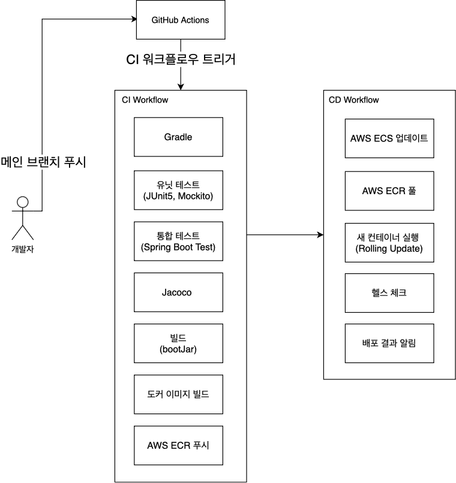
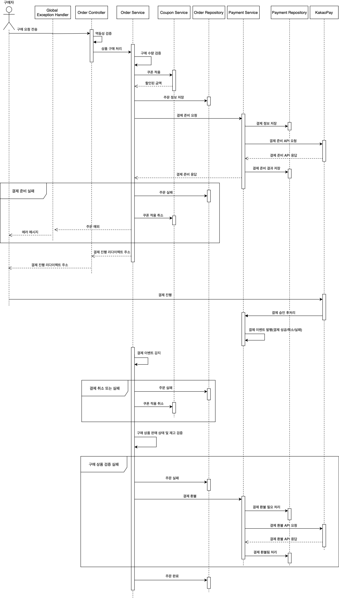

프로젝트 정보
- [프로젝트 개요](#프로젝트-개요)
- [전체 기능](#전체-기능)
- [기술 스택](#기술-스택)
- [아키텍처(시스템 구성도, 애플리케이션 및 패키지 구조,  ci/cd 파이프라인)](#아키텍처)
- [주문 기능](#주문-기능)
- [에러 처리](#비즈니스-예외-처리)
- [모니터링](#모니터링)


## 프로젝트 개요

ohmygoods 프로젝트는 이벤트성 굿즈 아이템들을 중점적으로 다루는 플랫폼입니다

좋아하는 분야에 대한 다양한 굿즈 상품들을 만나볼 수 있는 접근성을 소비자에게 제공하고, 판매자에게 고객들이 원하는 굿즈를 쉽게 검색하고 구매할 수 있는 환경을 제공하고자 합니다


## 전체 기능

계정 기능
- 회원가입(카카오 로그인 OAuth2)
- 로그인(JWT)
- 로그아웃
- 회원 탈퇴

상품 기능
- 상품 조회
- 카테고리 기반 조회

장바구니 기능
- 장바구니 조회
- 장바구니 담기
- 장바구니에 담긴 상품 수량 변경 또는 삭제

주문 및 결제 기능
- 주문
- 주문 내역 및 상세 조회
- 결제 및 결제 취소/실패

리뷰 기능
- 리뷰 조회/작성/수정/삭제
- 리뷰 댓글 조회/작성/수정/삭제
- 리뷰 대댓글 조회/작성/수정/삭제

판매자 기능
- 상점 생성/비활성화/삭제
- 상품 조회/등록/수정/삭제
- 쿠폰 조회/발행/삭제


## 기술 스택

#### 백엔드
- Java 21
- Spring Boot
- Spring WebMvc
- Spring Security
- Spring Data JPA
- Redisson
- Querydsl
- MySQL
- Redis

#### 빌드, 테스트 및 api 문서
- Gradle
- JUnit5
- Mockito
- Spring Boot Test
- spring doc (Swagger)

#### 모니터링
- Spring Boot Actuator
- Prometheus
- Grafana

#### 배포
- AWS
- GitHub Actions
- Docker


## 아키텍처

### 시스템 구성도


#### 사용자

restful api 요청을 보내거나 ssh를 통해 ec2 인스턴스에 접속하려는 주체입니다

백엔드 시스템만 구현한 상태이기 때문에 ssh, curl, postman 등을 통해 서버에게 요청을 보냅니다

#### AWS LoadBalancer

Application 로드 밸런서는 사용자 또는 외부 api의 http/https 및 ssh 요청을 수신하고 AWS VPC 내에 정상적으로 가동중인 스프링 부트(EC2, 8080 포트)에게 요청을 위임한 뒤 응답을 반환합니다

#### Spring Boot

인증/인가, 비즈니스 로직을 수행하는 주요 컴포넌트입니다 

외부 api(카카오 로그인, 카카오페이 결제)와 통신하거나 비즈니스 로직을 처리한 뒤 사용자의 데이터를 mysql, redis에 저장합니다 

스프링 부트 액추에이터의 엔드포인트를 노출하여 헬스 체크를 하거나 프로메테우스를 통해 애플리케이션 메트릭을 수집합니다

개발자는 그라파나 엔드포인트에 접근하여 수집된 메트릭을 확인하거나 스웨거 ui를 통해 api 문서를 확인할 수 있습니다

#### Redis

애플리케이션의 Refresh Token과 멱등 정보를 캐시합니다

도커 이미지를 통해 private subnet에 배포하고 inbound 규칙을 설정하여 외부 요청을 차단하면서 vpc 내의 스프링 부트 요청만 처리할 수 있도록 합니다

#### AWS S3

애플리케이션의 상품 이미지를 저장 및 관리합니다

ec2에 S3 관련 IAM Role을 부여하여 S3의 리소스에 안전하게 접근하도록 합니다 

#### Prometheus, Grafana

도커 이미지를 통해 ec2에 배포하고 스프링 부트 액추에이터의 엔드포인트(/actuator/prometheus)를 통해 메트릭을 수집합니다

그라파나 ec2의 엔드포인트에 특정 ip가 접근할 수 있도록 inbound 규칙을 설정합니다

#### Swagger UI

스프링 부트의 스웨거 ui 엔드포인트에 특정 ip가 접근할 수 있도록 설정하여 api 문서를 확인할 수 있게 합니다 


### 애플리케이션 및 패키지 구조


코드 레벨의 아키텍처는 컨트롤러, 서비스, 리포지토리로 구성되는 레이어드 아키텍처를 채택했으며 api 요청 처리의 흐름 과정에 참여하는 주요 계층의 역할은 다음과 같습니다

필터 계층
- api 요청이 들어오면 필터가 제일 먼저 받아서 인증이 필요한 요청인지 구분한 뒤, 필요한 경우 HTTP Authorization Header에 담긴 토큰을 검증합니다
- 검증 결과에 따라 필터 체인을 정상적으로 진행하거나 예외를 발생시킵니다. 검증 예외가 발생하면 예외 필터를 통해 HttpServletResponse에 에러 메시지를 담아 클라이언트에게 응답합니다
- OAuth2 로그인 요청인 경우 스프링 시큐리티 OAuth2 기능을 사용한 뒤, 성공 핸들러를 통해 애플리케이션의 Access/Refresh 토큰을 발급합니다 

컨트롤러 계층
- Bean Validation을 이용하여 요청 바디에 담긴 값이 유효한지 검증합니다
- 멱등성을 준수해야 되는 요청(주문, 쿠폰 발급 등)인 경우 스프링 AOP를 통해 일관적으로 멱등 캐시 로직을 처리합니다. 중복된 멱등 요청이라면 캐시된 값을 반환하거나 예외를 발생시킵니다
- 서비스 계층의 DTO로 데이터를 변환한 뒤 요청을 위임합니다

서비스 계층
- 주문, 결제, 장바구니, 쿠폰 등 기능에 따른 비즈니스 로직을 수행합니다
- 리포지토리(Data JPA, Querydsl)를 사용하여 데이터베이스와 상호작용하거나 리프레쉬 토큰을 레디스에 캐시합니다
- RestClient를 통해 카카오결제 api를 호출하거나 S3Client로 AWS S3에 이미지를 저장 및 관리합니다

GlobalExceptionHandler
- 애플리케이션에서 발생하는 모든 도메인 예외와 컨트롤러 검증 관련 예외를 처리합니다
- 스프링 프레임워크 6.0부터 도입된 ProblemDetail를 활용하여 에러 메시지를 통일합니다

#### 패키지 구조

```text
ohmygoods
- auth
- product
- coupon
    - controller
    - service
    - repository
    - model
    - exception
- order
- payment
- global
    - exception
    - idempotency
    - config
```

패키지 간 의존성을 최소화하고 각 패키지가 독립적으로 로직을 처리할 수 있도록 주요 기능 별로 패키지를 구분하였습니다

각 기능 패키지는 계층(컨트롤러/서비스/리포지토리) 및 예외, 모델(JPA 엔티티, VO) 하위 패키지로 구성됩니다

global 패키지는 특정 기능에 종속되지 않고 애플리케이션 전역에서 사용되는 기능 또는 컴포넌트들이 위치한 패키지이며 글로벌 예외 처리기, 멱등성 처리, 자바 설정 등이 있습니다

### 배포 구조



(2025.03.08 기준) 현재 GitHub Actions를 이용한 ci/cd 파이프라인을 구축하고 있으며 최종 목표는 위의 다이어그램과 같습니다 (아키텍처 변경 및 기타 요구사항으로 인해 추후 변경될 수 있습니다)

ci 파이프라인
- 깃허브 메인 브랜치에 코드를 푸시하면 ci 워크플로우를 트리거합니다
- 그레이들 래퍼를 통해 로컬 환경과 ci 환경의 그레이들 버전을 통일합니다
- 유닛 및 통합 테스트를 수행하고, jacoco 커버리지 리포트를 아티팩트로 업로드하여 테스트 커버리지를 확인합니다
- 스프링 부트 도커 이미지를 만든 뒤 AWS ECR에 푸시합니다

cd 파이프라인
- ci 파이프라인이 정상적으로 수행되면 cd 파이프라인을 실행합니다
- AWS ECS를 업데이트하여 두 개의 EC2에서 실행 중인 컨테이너를 ECR에 업로드된 새로운 도커 이미지로 변경합니다
- 이 때 Rolling Update 배포 전략을 사용하여 무중단 배포를 수행합니다
- 배포가 완료되면 헬스 체크를 통해 정상적으로 동작하는지 확인하고 배포 결과를 이메일로 전송합니다 


## 주문 기능

주문 기능은 사용자가 상품을 선택하여 주문을 생성하고 쿠폰 적용 및 결제까지 이어지는 프로세스를 수행하며 주요 흐름은 아래와 같습니다

```text
사용자 주문 요청 -> 주문 전처리 -> 결제 -> 주문 -> 주문 완료
```

### 시퀀스 다이어그램



### 상세 설명

#### 1. 사용자 주문 요청 (멱등성 준수 및 요청 정보 검증 단계)

[주문 컨트롤러 객체](./app/src/main/java/co/ohmygoods/order/controller/OrderController.java), [멱등성 Aspect 객체](./app/src/main/java/co/ohmygoods/global/idempotency/aop/ControllerIdempotencyAspect.java)

사용자는 주문할 상품과 상품에 적용할 쿠폰 정보 및 멱등키를 담은 RESTful API 요청을 서버에게 전달합니다

##### 1.1 멱등성 준수: 중복 요청 방지

요청을 수신한 서버는 중복 주문 요청을 방지하기 위해 Access Token, 멱등키, HTTP Method, Servlet Path를 기반으로 멱등 요청 정보를 추출한 뒤 레디스에 이미 캐시된 멱등 요청이 있는지 확인합니다

캐시된 값을 통해 **이미 처리 중인 요청**인 것을 파악하면 409 Conflict 예외를 발생시키고, **처리된 요청**이라면 저장된 HTTP 상태 코드와 바디를 응답합니다

캐시된 값이 없다면 새로운 멱등 요청 정보를 레디스에 저장하는데, 그 사이에 중복된 주문 요청을 클라이언트에서 전달할 수 있으므로 RedissonClient를 통해 락을 획득합니다

락 획득에 실패한다면 다른 스레드에서 이미 요청 처리 중인 것으로 판단하여 409 Conflict 예외를 발생시킵니다

락 획득에 성공한다면 멱등 요청 정보를 레디스에 저장한 뒤 컨트롤러의 메서드를 실행시킵니다

이후 컨트롤러가 반환한 값으로부터 응답 HTTP 상태 코드와 바디 정보를 추출하고 아까 레디스에 저장한 멱등 요청 정보에 이 값들을 매핑하여 클라이언트에서 동일한 요청을 전송하면 캐시한 값을 반환할 수 있도록 합니다

##### 1.2 요청 정보 검증

Bean Validation을 이용하여 HTTP Body에 담긴 요청 정보가 적절한 값을 담고 있는지 검증합니다

유효한 값들을 포함한 경우 서비스 객체에서 필요로 하는 DTO로 변환한 뒤 요청을 위임합니다 

#### 2. 주문 전처리 (주문 엔티티 생성 및 쿠폰 적용 단계)

##### 2.1 주문 생성

[주문 서비스 객체](./app/src/main/java/co/ohmygoods/order/service/SimpleOrderTransactionService.java)

요청을 받은 서비스 객체는 가장 먼저 데이터베이스로부터 주문한 사용자, 주소지, 상품들을 조회합니다

그리고 사용자가 주문한 상품마다 구매 수량이 적절한지 검증한 뒤 상품 할인과 쿠폰을 적용한 주문 엔티티를 생성합니다

각 상품에 대한 주문 엔티티를 생성하면 전체 주문 정보를 총괄하는 "주문 시작" 상태로 주문 엔티티를 생성하고 데이터베이스에 저장합니다

주문 전처리가 모두 완료되면 주문 정보를 바탕으로 결제 요청을 생성하고 결제 서비스의 결제 시작 메서드를 호출합니다

##### 2.2 쿠폰 적용

사용자가 쿠폰을 사용한 경우 주문 생성 과정에서 쿠폰 서비스의 쿠폰 메서드를 호출합니다

쿠폰 서비스는 쿠폰을 적용하기 전에 사용할 수 있는 쿠폰인지 확인합니다

정상 쿠폰이라면 할인 금액을 계산한 뒤 쿠폰 사용 내역에 해당 쿠폰의 사용 내역을 기록합니다

#### 3. 결제 (결제 진행 및 결과 이벤트 발행 단계)

##### 3.1 결제 준비 API 호출

[결제 서비스 객체](./app/src/main/java/co/ohmygoods/payment/service/PaymentGateway.java)

결제 서비스는 결제 요청 정보를 바탕으로 결제 엔티티를 저장한 뒤 카카오페이 결제 시스템에게 결제 준비 API를 요청합니다

정상 응답을 받았다면 "결제 준비됨"으로 결제 엔티티의 상태를 변경하고 응답 값을 주문 서비스에게 반환합니다

##### 3.2 결제 승인 API 호출

주문 서비스는 호출한 결제 시작 메서드로부터 받은 리다이렉트 주소 값을 클라이언트에게 반환하여 사용자의 후속 결제 진행을 도모합니다

사용자가 카카오페이 결제를 진행하면 카카오페이 시스템으로부터 결제 진행 요청을 받습니다

이후 결제 도메인에서 요청한 결제 승인 API가 정상적으로 수행되면 "결제 성공"으로 결제 엔티티의 상태를 변경하고 스프링 이벤트 퍼블리셔를 사용하여 결제 성공 이벤트를 발행합니다

#### 4. 주문 (재고 확인 및 주문 처리 단계)

주문 서비스는 결제 도메인에서 발행한 결제 성공 이벤트를 감지하고 관련 주문 엔티티를 데이터베이스로부터 조회합니다

조회된 주문 엔티티에 속한 각 주문 아이템마다 남은 수량을 사용자가 주문한 구매 수량만큼 차감합니다

이 과정에서 판매 상태, 구매 수량 초과 또는 잔여 수량 부족 예외가 발생할 수 있으며, 발생한 예외의 종류에 따라 사유를 명시하고 주문 실패 처리합니다 (쿠폰 적용 취소 등)

모든 아이템에 대한 재고 차감이 정상적으로 수행된 경우 주문을 성공한 것으로 판단하여 최종적으로 "주문 완료" 상태로 주문을 변경한 뒤 주문 성공 로그를 남깁니다

### 주문 비즈니스 규칙

#### 1. 쿠폰 적용

쿠폰은 상품별로 하나씩만 적용할 수 있으며, 설정된 최대 할인 금액만큼만 상품 금액을 할인합니다

#### 2. 재고 차감

불필요한 재고 롤백 문제를 최소화할 수 있는 확정형 방식을 사용합니다

사용자로부터 요청을 받은 즉시 재고를 차감하지 않고, 결제 프로세스를 모두 진행한 뒤 결제가 성공하면 상품의 재고를 차감합니다

결제 대기 중 다른 사용자가 구매할 가능성이 존재합니다 

#### 3. 주문 처리

상황에 따른 주문 상태를 처리하는 방식은 다음과 같습니다

| 상황                     | 처리                                                   |
|------------------------|------------------------------------------------------|
| 구매 가능한 수량을 초과함 | 주문 상태 ORDER_FAILED_OUT_OF_STOCK로 변경                  |
| 결제 승인 및 재고 정상 차감됨      | 주문 상태 ORDERED로 변경                                    |
| 결제 승인됐으나 재고가 부족함       | 주문 상태 ORDER_FAILED_LACK_QUANTITY로 변경, 주문 및 쿠폰 적용 취소  |
| 결제 실패                  | 주문 상태 ORDER_FAILED_PAYMENT_FAILURE로 변경, 주문 및 쿠폰 적용 취소 |


## 비즈니스 예외 처리

프로젝트의 예외 처리 목표는 다음과 같습니다
- 비즈니스 예외를 일관된 방식으로 처리하여 유지보수성과 확장성을 높인다
- Problem Detail 포맷을 사용하여 이해하기 쉬운 예외 메시지를 클라이언트에게 전달한다

GlobalExceptionHandler 객체를 통해 예외 처리를 중앙화하고 예외 정보와 예외 클래스를 추상화하여 예외 메시지의 구조를 통일합니다
- [GlobalExceptionHandler](): 프로젝트에서 발생하는 모든 비즈니스 예외를 처리하며 클라이언트에게 Problem Detail 형식의 예외 메시지를 반환하는 @ExceptionHandler 입니다
- [DomainError: 예외 정보 추상화](): HTTPStatus, 비즈니스 예외 코드, 에러 메시지를 추상화한 인터페이스입니다
- [DomainException: 예외 클래스 추상화](): 예외 정보 및 추가 정보(type, instance)를 가지는 추상 클래스입니다

### 패키지별 비즈니스 예외 정의

각 도메인 패키지별로 예외 정보를 가지는 enum과 enum constant마다 예외 인스턴스를 미리 생성하는 도메인 예외 클래스를 정의합니다

예를 들어 주문 패키지에는 주문 비즈니스 로직을 수행하면서 발생할 수 있는 모든 예외 종류별로 예외 정보를 가지는 OrderError를 정의합니다

OrderError는 공통 모듈에서 정의한 DomainError를 구현하여 HttpStatus, 비즈니스 예외 코드, 에러 메시지를 반환합니다

```java
public enum OrderError implements DomainError {

    INVALID_PURCHASE_AMOUNT(HttpStatus.BAD_REQUEST, "O100", "유효하지 않은 구매 금액입니다."),
    INVALID_PURCHASE_QUANTITY(HttpStatus.BAD_REQUEST, "O101", "유효하지 않은 구매 수량입니다."),
    // ...

    @Override
    public HttpStatus getHttpStatus() {
        return httpStatus;
    }

    @Override
    public String getErrorCode() {
        return errorCode;
    }

    @Override
    public String getErrorMessage() {
        return errorMessage;
    }
}
```

그리고 OrderException 클래스에서 OrderError의 각 상수값마다 static final 필드로 예외 인스턴스를 생성합니다

이 방식을 사용하면 매번 비즈니스 예외가 발생할 때마다 인스턴스를 새롭게 만들 필요가 없으면서 필드명으로 어떤 비즈니스 예외인지 코드 상에서 명확하게 표현할 수 있습니다

```java
public class OrderException extends DomainException {

    public static final OrderException INVALID_PURCHASE_AMOUNT = new OrderException(OrderError.INVALID_PURCHASE_AMOUNT);
    public static final OrderException INVALID_PURCHASE_QUANTITY = new OrderException(OrderError.INVALID_PURCHASE_QUANTITY);
}
```

다음과 같이 주문 비즈니스 로직에서 OrderException의 필드를 통해 예외를 발생시킬 수 있습니다

```java
// 사용자의 구매 개수가 유효하지 않은 경우 INVALID_PURCHASE_QUANTITY 예외 발생
if (product.isValidRequestQuantity(orderDetail.purchaseQuantity())) {
        throw OrderException.INVALID_PURCHASE_QUANTITY;
}
```

### 공통 예외 처리 (스프링 시큐리티 필터 포함)

global 패키지의 GlobalExceptionHandler 객체에서 추상화한 DomainException 클래스를 통해 프로젝트에서 발생하는 모든 비즈니스 예외를 처리합니다

비즈니스 예외 클래스를 바탕으로 ProblemDetail 객체를 생성하여 클라이언트에게 일관된 구조를 가진 에러 메시지를 반환합니다

ProblemDetail은 기존 ErrorResponse 클래스를 대체하기 위해 스프링 프레임워크 6.0부터 도입된 클래스로 RFC 7807(Problem Details for HTTP APIs) 표준을 지원합니다 

```java
public class GlobalExceptionHandler extends ResponseEntityExceptionHandler {

    @ExceptionHandler(DomainException.class)
    public ResponseEntity<ProblemDetail> handleDomainException(DomainException e) {
        
        ProblemDetailInfo problemDetailInfo = ProblemDetailInfo.builder()
                .exception(e)
                .httpStatusCode(e.getHttpStatus())
                .type(e.getType())
                .title(e.getErrorMessage())
                .errorCode(e.getErrorCode())
                .detail(e.getErrorDetailMessage())
                .instance(e.getInstance())
                .build();

        return ProblemDetailResponseEntityBuilder.build(problemDetailInfo);
    }
}
```

@ExceptionHandler는 컨트롤러 이후에 발생하는 예외만 처리할 수 있는 특징이 있습니다

ohmygoods 프로젝트는 사용자의 인증 수단으로 JWT를 사용하여 이를 필터 단에서 검증하고, 유효하지 않은 액세스 토큰인 경우 예외를 발생시킵니다

필터는 컨트롤러보다 먼저 동작하므로 발생하는 예외는 @ExceptionHandler가 처리할 수 없으며 기본적으로 스프링 시큐리티에서 제공하는 ExceptionTranslationFilter에서 에러를 처리합니다

AuthenticationEntryPoint를 통해 클라이언트에게 인증 예외를 알릴 수도 있겠지만 JWT 예외를 세밀하게 분류하고 여타 비즈니스 예외와 동일한 Problem Detail 형식을 사용하고자 했습니다

이를 위해 필터 단에서 발생할 수 있는 인증 예외(스프링 인증/인가 에러 포함)를 처리하는 [필터]()를 추가하고 ProblemDetail 객체를 생성하는 [빌더 클래스]()를 정의했습니다

결과적으로 JWT 인증 예외 및 스프링 시큐리티 RBAC 권한 검증 예외 처리 방식을 일반 비즈니스 예외 처리 방식과 통일하여 일관된 에러 메시지를 클라이언트에게 전달할 수 있게 되었습니다 


## 모니터링

예기치 않은 장애를 탐지하거나 스프링 부트 애플리케이션의 메트릭을 확인하기 위해 prometheus와 grafana를 사용하여 모니터링 시스템을 구축해보았습니다

시스템 구성과 서비스 간 상호작용은 아래와 같습니다


ECS EC2에서 동작하는 프로메테우스는 스프링 부트 액추에이터의 프로메테우스 엔드포인트를 통해 애플리케이션 메트릭(마이크로미터)을 수집합니다

AlertManager와 연동하여 특정 조건을 충족하는 경우 이메일로 알림을 발송합니다

그라파나는 프로메테우스에서 수집한 메트릭을 기반으로 대시보드 생성 및 시각화하며, 개발자는 설정된 inbound 규칙을 통해 그라파나 엔드포인트에 접근하여 대시보드를 확인할 수 있습니다

### 주요 메트릭

프로메테우스는 다음의 메트릭을 수집합니다
- http_server_requests_seconds: HTTP 요청 응답 시간
- jvm_memory_used_bytes: JVM 메모리 사용량
- process_cpu_usage: CPU 사용률
- system_load_average: 시스템 부하율